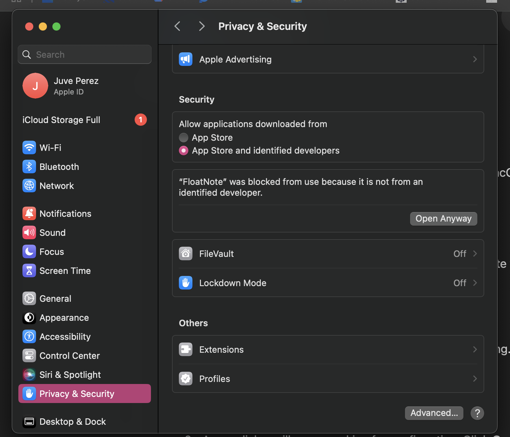
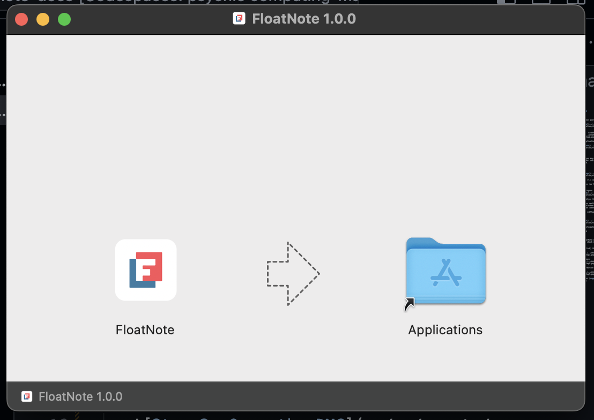
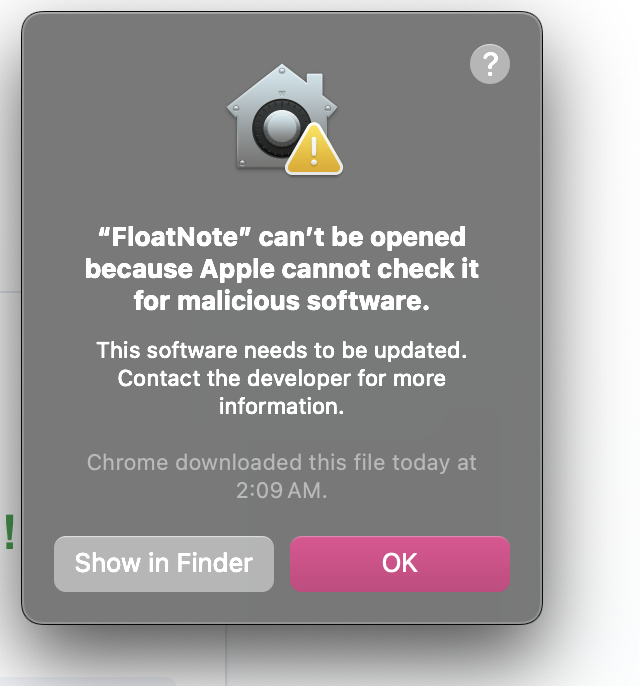

# Installing FloatNote on macOS

## Download and Installation

1. **Download FloatNote from your purchase email or account dashboard**  
   

2. **Open the downloaded `.dmg` file**  
   

3. **Drag FloatNote to your Applications folder**  
   

## First Launch

When first opening FloatNote, you may see security messages. This is normal and designed to protect your system.

### Opening FloatNote Securely

1. **Open System Settings**  
   
   1. Click the **Apple menu** (🍎) in the top-left corner
   2. Select **System Settings** (or System Preferences)

2. **Navigate to Security Settings**  
   
   1. Select **Privacy & Security** from the sidebar
   2. Scroll to the **Security** section
   3. Look for "FloatNote was blocked from use because it is not from an identified developer"
   4. Click **Open Anyway** or **Allow Anyway**

3. **Final Confirmation**  
   
   1. Click **Open** in the confirmation dialog
   2. FloatNote will now launch

## Troubleshooting

If you see a message that "FloatNote can't be opened because Apple cannot check it for malicious software":

1. **Right-click (or Control-click) the FloatNote app**  
   

2. **Select "Open" from the menu**  
   

3. **Click "Open" in the confirmation dialog**  
   

Still having issues? Contact our [support team](mailto:support@ryacy.com).
